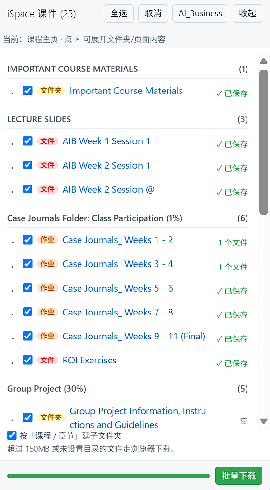

# iSpace 课件批量查看/下载 (BNBU)

一个油猴脚本（Tampermonkey / Greasemonkey），在 [iSpace](https://ispace.bnbu.edu.cn) 课程页面**统一查看**课程资料，并**批量下载**真实课件文件到本地 —— 文件名完整保留、目录结构可按课程 / 章节自动组织，全程不弹油猴确认页。

支持在课程主页内联展开 `文件夹` / `页面` / `资源` 条目，无需跳转新页面即可获取其中所有真实文件。



---

## 功能特性

- **统一视图**：课程主页右下角浮动面板，按章节列出全部课件资源
- **多类型识别**：在课程主页就能识别并展示 `文件 / 文件夹 / 页面 / 链接` 四种活动类型，每种用不同 badge 标识（红 / 黄 / 绿 / 蓝）
- **就地展开**：对于 `文件夹` / `页面` / `资源` 条目，点行前的 `▸` 箭头即可**就地展开内部所有真实文件**，不必跳转新页面
- **跟随任意相关页面**：在 `mod/folder/view.php`、`mod/page/view.php`、`mod/resource/view.php`、`mod/assign/view.php` 页面打开时同样生效，自动列出当前页内全部文件
- **批量下载**：一键解析每个文件的真实直链（含带签名 token 的 pluginfile URL），逐个取回内容保存，并在面板显示进度与每个文件的状态
- **文件名完整保留**：以直链末段作为权威来源，缺扩展名时自动补齐（`view.php` 直接吐文件时按 MIME 补后缀），同名文件自动追加 ` (2)`
- **识别 302 直链**：`mod/resource` 的"强制下载"展示方式会把 `view.php` 整体 302 到文件本体，脚本能正确解析，不再出现"面板上有名字但解析不出文件"
- **多种文件入口**：`pluginfile.php` / `tokenpluginfile.php` / `webservice/pluginfile.php` / `draftfile.php` 全覆盖
- **内容校验**：返回 HTML（登录页 / 防盗链页）或空内容时立即判定失败，**绝不把网页静默存成 `.pdf`**
- **自动下载策略**：默认取回文件内容再保存（文件名最准、可校验）；超过 150MB 的大文件自动改由浏览器直接下载（零内存、可用下载管理器）；全程无需手动设置
- **自定义保存目录**（Chrome / Edge）：点「保存目录」选一个本地文件夹，文件**直接写入**该目录（绕过下载管理器，也不再触发"多文件下载"拦截条）；目录句柄存 IndexedDB 跨会话自动恢复
- **按课程·章节自动分文件夹**（默认开启）：开启后写入 `保存目录/课程名/章节名/文件` 的层级结构，目录不存在时自动创建；可随时关闭改回平铺
- **懒加载**：只在你点 `▸` 或点批量下载时才会去解析容器页面，不影响课程页打开速度

---

## 安装

### 1. 安装 Tampermonkey 扩展

| 浏览器 | 步骤 |
|---|---|
| Chrome / Edge | 访问 [Tampermonkey 官网](https://www.tampermonkey.net/)，跳转到扩展商店安装 |
| Firefox | 在附加组件商店搜索 Tampermonkey，或从官网安装 |
| Safari / 其他 | 官网有对应版本 |

### 2. 安装本脚本

有两种方式任选其一：

**方式 A：拖拽安装（推荐）**

打开任意一个普通网页标签页，将 `iSpace_Downloader.user.js` 文件**直接拖入**浏览器窗口，Tampermonkey 会弹出安装确认页，点「安装」即可。

**方式 B：手动粘贴**

1. 用编辑器打开 `iSpace_Downloader.user.js`，全选复制全部内容
2. 点击浏览器右上角的 Tampermonkey 图标 → 「添加新脚本 / Create a new script」
3. 把编辑器里默认的内容**全部删掉**，粘贴刚才复制的内容
4. `Ctrl + S` 保存

安装成功后，Tampermonkey 图标 → 「管理面板」，列表里会出现 `iSpace 课件批量查看/下载 (BNBU)`，状态为已启用。

### 3. 无需配置下载模式

脚本不使用 `GM_download`，下载全程走页面原生 API（`fetch → Blob → a[download]`），因此：

- 不依赖 Tampermonkey 的 **Download Mode** 设置，也不需要 `downloads` 权限
- 不会弹出任何油猴下载确认页或权限请求
- 文件名与扩展名完全由脚本决定，不受油猴「下载 BETA」扩展名白名单影响
- 超过 150MB 的文件会自动改由浏览器直接下载（省内存、可用下载管理器）

### 4.（可选）设置自定义保存目录

点面板右上角的「保存目录」按钮，选一个本地文件夹，之后批量下载的文件**直接写入该目录**：

- 目录句柄会存进浏览器 IndexedDB，下次打开课程页自动恢复，无需重复选择
- 重新打开页面后首次写入可能需要点一次浏览器授权提示，允许即可
- **仅 Chrome / Edge** 支持；Firefox / Safari 会自动降级为下载到浏览器默认目录
- 已设置目录时再点该按钮，可「确定更换 / 取消清除」
- 面板底部「按课程 / 章节建子文件夹」默认勾选，文件会写入 `保存目录/课程名/章节名/文件`；取消勾选则平铺写入保存目录根下。课程名取自课程主页标题（其他页面从面包屑取），章节名取自课程主页的 section 名称

---

## 使用方法

### 场景一：在课程主页直接查看与下载

打开任意课程主页，例如：

```
https://ispace.bnbu.edu.cn/course/view.php?id=10407
```

面板会在**右下角**自动出现：

- 左边带 `▸` 的项（`文件夹` / `页面` / `资源`）：点 `▸` 即可在主面板就地展开内部所有真实文件
- 不带 `▸` 的项（`文件` / `链接`）：直接勾选加入批量下载
- **批量下载**：把所有勾选项的真实文件解析后依次保存，并在状态列显示 `✓ 已保存`

### 场景二：在文件夹 / 页面 / 资源页面工作

如果你已经进入 `mod/folder/view.php?id=...`、`mod/page/view.php?id=...` 等页面，刷新一下页面，脚本会在右下角继续工作，**直接列出当前页面内的全部文件**。

| 页面 | 自动行为 |
|---|---|
| `course/view.php` | 按章节分组，列 `文件 / 文件夹 / 页面 / 链接` |
| `mod/folder/view.php` | 列出该文件夹内全部真实文件（含子文件夹里的） |
| `mod/page/view.php` | 列出页面正文内所有附件与内嵌图片 |
| `mod/resource/view.php` | 解析出该资源的真实文件直链，可立即下载 |
| `mod/assign/view.php` | 列出作业页中的全部附件（含教师在 intro / additional files 添加的模板与资料） |

---

## 实际效果展示

下图为本脚本在课程主页的运行效果（保存目录已设为本地文件夹 `test`，已批量下载 6 个文件，"按课程 / 章节建子文件夹" 开启）：


可以注意到：

- 标题栏显示 `iSpace 课件 (11)` —— 当前页面共 11 个可下载/可查看项
- 右上角「保存目录」按钮显示为目录名 `test`（未设置时显示「保存目录」；不支持的浏览器显示「目录不可用」）
- 4 个章节：`IMPORTANT COURSE MATERIALS (1)` / `LECTURE SLIDES (1)` / `AI-Powered Learning Platforms (2)` / `Recommended Reading (6)`
- `Important Course Materials` 是**文件夹**（黄色 badge），前面带 `▸`，展开后可看到内部 PDF
- `AIB Week 1 Session 1` 是**文件**（红色 badge），前面带 `▸` 是因为它本身是 `resource` 容器
- `AIB Enterprise Workspace` / `AIDE platform` 是**链接**（蓝色 badge）—— 这是 `mod/url` 活动，**只可点击打开外链，不能下载**（外链不是文件）
- `BCG Report` / `BCG questions` / `MIT Report` / `2026-The Age of the AI Supply Chain` 都是**文件**（红色 badge），状态列显示 `✓ 已保存`，表示已写入 `test/<课程名>/<章节名>/<文件>`
- 底部「按「课程 / 章节」建子文件夹」默认勾选，文件会按课程名 / 章节名自动分层到 `test` 下

---

## 常见问题

### Q1：课件面板没有出现？

请先检查：

1. 浏览器控制台（F12 → Console）是否有红色错误？
2. 是否已登录 iSpace？脚本依赖登录后的 Cookie 请求详情页
3. 是否只在课程主页打开？脚本不会在 iSpace 首页、个人页等其它位置出现

如果还是不行，把控制台里带 `[iSpace-DL]` 前缀的日志原文发出来。

### Q2：点了批量下载，但浏览器没有反应？

**未设置保存目录**时，Chrome / Edge 通常会弹出「此站点试图下载多个文件」的拦截条，**必须点允许**。该提示只出现在第一次，之后会记住。

**设置了保存目录**后，文件直接写入该目录，**不会再触发这条拦截条**。

### Q2.1：还会弹油猴的下载确认页吗？

不会。从 v2.1.0 起脚本不再调用 `GM_download`，下载完全在页面内完成，不存在油猴确认页、权限请求或「下载 BETA」白名单的问题。

### Q3：为什么有些容器展开后显示「未发现文件」？

- **Page 类型**：页面内容是纯 HTML 文本，没有附件，属于正常情况，请直接点开页面人工查看
- **Folder 类型**：通常是该文件夹还没有任何文件，或使用了非标准 Moodle 模板

### Q3.1：有些课件「点一下就能下载」，但脚本解析不出来？

这类活动（几乎都是 `mod/resource`）在浏览器里点击后会**由服务端 302 跳到真实文件直链**。v2.1.0 之前脚本会把它当成 HTML 解析，自然什么都找不到。

现在脚本的处理顺序是：

```
fetch('/mod/resource/view.php?id=X')
   ├─ 响应是文件（URL 已跳到 pluginfile / Content-Type 非 HTML）→ 直接用最终直链
   ├─ 响应是网页 → 从 DOM 里提取文件链接
   └─ 网页里没有文件 → 补一次 &redirect=1（Moodle 的 view.php 支持该参数直接跳文件）
```

同时文件入口的识别也从「只认 `pluginfile.php`」扩展到了 `tokenpluginfile.php`、`webservice/pluginfile.php`、`draftfile.php`，避免这些入口被漏掉。

### Q3.2：下载"成功"了，但文件打不开？

脚本会对响应做校验：如果服务端返回的是 HTML（未登录 / 无权限 / 防盗链跳转页）或空内容，会在面板上标 `✗` 并自动回退，**不再把网页静默存成 `.pdf`**。如果看到 `✗ 服务器返回的是网页而非文件`，请刷新页面重新登录后再试。

### Q4：「保存目录」按钮显示「目录不可用」？

当前浏览器不支持 **File System Access API**（仅 Chrome / Edge 支持）。该功能自动降级为下载到浏览器默认目录，「按课程 / 章节建子文件夹」开关也不会生效（因为没目录可写）。

### Q5：能否直接打包成 ZIP 下载？

当前版本逐个触发下载，是为了与浏览器对多文件下载的限制相兼容（避免被安全策略拦截）。如果你需要 ZIP 打包功能，可在脚本基础上扩展 `JSZip` + `a.download` 异步批量保存。

### Q6：会触发 iSpace 风控吗？

不会。脚本只使用常规的 `fetch` 请求（与浏览器自身加载页面相同），并使用你的**登录态 Cookie**，不会绕过任何限制。所有操作在你的浏览器内完成，不经过任何第三方服务器。

---

## 适用平台

- iSpace (BNBU Moodle)：`https://ispace.bnbu.edu.cn`
- 兼容 Moodle 4.x 与 3.x（标准主题 classic / boost）
- 已测试 Chrome / Edge / Firefox 最新版
- **「保存目录」与「按课程 / 章节建子文件夹」功能仅 Chrome / Edge 生效**

---

## 工作原理

```
进入页面（course / folder / page / resource）
        │
        ▼
扫描 DOM，匹配 li.activity / pluginfile 链接
        │
        ▼
按章节分组，构建浮动面板 UI
        │
        ▼
用户操作：
├─ 勾选 → 直接加入下载队列（已知直链）
└─ 展开 ▸ → fetch 该页面 → 提取所有 pluginfile 链接
                              （含 302 跳转、&redirect=1 兜底、多种文件入口）
        │
        ▼
文件名解析：直链末段为权威 + DOM 文本美化 + 缺后缀自动补齐 + 重名加 (2)
        │
        ▼
逐个取回内容：
  ├─ 优先写入「保存目录」/课程名/章节名/文件（File System Access API）
  └─ 超过 150MB 自动改浏览器直下，或目录写入失败/未设置时回退
        间隔 350ms 节流
```

---

## 更新脚本

修改本地 `.user.js` 文件后，必须**重新导入一次**才能覆盖 Tampermonkey 里的旧版本（脚本不会自动同步）：

1. 把更新后的 `iSpace_Downloader.user.js` 文件再次拖到浏览器
2. 在弹出的确认页点「安装」（若提示「是否替换」，确认替换）
3. 回到课程页 `Ctrl + F5` 强制刷新

---

## 更新记录

### v2.4.0

- **新增作业页面支持**：在 `mod/assign/view.php` 打开时自动识别并列出作业页内的全部附件（教师在 intro / additional files 添加的模板与资料，与 `mod/page` / `mod/resource` 同样走 `pluginfile.php` 链接，文件名解析、重命名、目录分层等全部沿用）
- 关联变更：补全 `@match` / `getPageType()` / `collectCurrentPage()` / 面板 typeLabel 四个点

### v2.3.0

- **按课程·章节自动分文件夹**：新增「按课程 / 章节建子文件夹」开关（默认开启，偏好存 `localStorage`）；开启后文件写入 `保存目录/课程名/章节名/文件`，用 `getDirectoryHandle(..., {create:true})` 逐级自动建目录
- **课程名 / 章节名识别**：课程主页取 `<h1>` 为课程名、`.sectionname` 为章节名；其他页面从面包屑 `a[href*="/course/view.php?id="]` 取课程名、以当前活动名作为子文件夹；文件夹名复用 `sanitize()` 清洗（去非法字符 / 结尾点 / Windows 保留名）

### v2.2.0

- **新增自定义保存目录**：基于 File System Access API，点「保存目录」选一个本地文件夹，文件直接写入该目录（绕过下载管理器、也不再触发多文件下载拦截条）；目录句柄存 IndexedDB 跨会话恢复，支持更换/清除
- **运行上下文调整**：脚本改为 `@grant none` 在页面上下文运行（脚本本就不依赖任何 GM_* API），以便访问 `showDirectoryPicker`；不支持的浏览器自动降级为浏览器默认下载目录

### v2.1.1

- **合并下载模式为单一路径**：移除面板底部的「内容方式 / 直链方式」下拉（以及不再需要的 `GM_setValue` / `GM_getValue`），改为 `downloadAuto()` 自动决策——默认取回内容再保存（文件名最准、可校验），超过 150MB 的大文件在读到响应头后立即改由浏览器直接下载（零内存占用、可用下载管理器），用户无需任何手动设置

### v2.1.0

- **移除 `GM_download`**：改用 `fetch → Blob → a[download]`，不再经过油猴下载通道，彻底消除油猴确认页 / 权限请求 / 扩展名白名单问题
- **修复文件名丢失扩展名**：
  - 修复 `sanitize() || nameFromUrl()` 因前者恒为真值导致兜底逻辑失效的问题（这是 `object` / `embed` / `iframe` 里的文件被存成 `file` 的直接原因）
  - 新增 `resolveName()`：以直链末段为权威，DOM 文本缺扩展名时自动补齐，扩展名冲突时以 URL 为准
  - 内嵌图片改用 URL 原始文件名，不再用 `alt`
- **新增重名去重**：同名文件自动追加 ` (2)`，避免互相覆盖
- **修好「点一下就能下载」的课件**：
  - 识别 302 直链：`fetchDoc()` 检查 `res.url` 与 `Content-Type`，`view.php` 直接跳到真实文件时采用最终直链
  - `&redirect=1` 兜底：网页里找不到文件时补一次该参数请求
  - 扩展文件入口：从只认 `pluginfile.php` 扩展到 `tokenpluginfile.php` / `webservice/pluginfile.php` / `draftfile.php`
  - 按 MIME 兜底命名：服务端在原 URL 上直接吐文件时用活动名 + Content-Type 补扩展名
  - 响应内容校验：返回 HTML 或空内容时判定失败并回退，不再静默存坏文件
  - 错误更明确：登录态失效会提示「登录态失效，请刷新页面后重试」
- **修复重复下载**：批量下载时，已展开过的容器会被跳过（避免每个文件下载两份、出现 `xxx (2).pdf`）；同时新增按直链 URL 去重同一队列
- **`sanitize()` 增强**：控制字符过滤、结尾点/空格清理、Windows 保留名处理；面板文本全部 HTML 转义

---

## License

MIT
